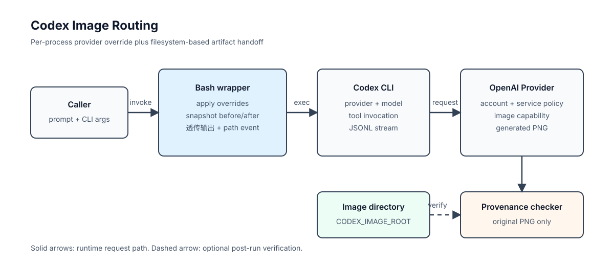

# Architecture

## Scope

The wrapper routes one `codex exec` call and hands the generated file path back to the caller. Codex, the image model, login, and billing remain outside the wrapper.



## Components

| Component | Responsibility | Repository boundary |
| --- | --- | --- |
| Caller | Supplies a prompt and CLI arguments. | Outside this repository. |
| `codex-openai-image` | Applies per-process configuration, snapshots the output directory, forwards stdout/stderr, and emits a path event. | `scripts/codex-openai-image` |
| Codex CLI | Resolves the selected provider and model, then executes the image tool when available. | External dependency. |
| OpenAI Provider | Receives the Codex request and exposes the image-generation capability according to the account and service configuration. | External service. |
| Generated image directory | Stores the PNG files that the wrapper compares before and after execution. | `$CODEX_HOME/generated_images/` by default. |
| Provenance checker | Reads recognizable provenance strings from an original PNG. | `scripts/verify-image-provenance.sh` |

## Request path

1. The caller starts the wrapper with the arguments intended for `codex exec`.
2. The wrapper resolves `CODEX_IMAGE_ROOT` and records the existing `*.png` paths.
3. The wrapper starts Codex with process-local values for `model_provider`, `model`, and `model_reasoning_effort`.
4. Codex handles the prompt and requests image generation if the selected model and account allow it.
5. The generated PNG is written to the configured directory.
6. The wrapper takes a second snapshot, finds paths that were not present before the call, selects the newest one, and emits a JSONL event with `saved_path`.
7. The caller may pass the original file to the provenance checker as a separate step.

The wrapper reads the output directory instead of parsing model prose for a path.

## Configuration precedence

The wrapper injects settings into the child Codex process. It does not write `config.toml`.

```text
caller environment
  CODEX_IMAGE_MODEL
  CODEX_IMAGE_EFFORT
  CODEX_BIN
  CODEX_IMAGE_ROOT
        |
        v
wrapper command-line overrides
        |
        v
Codex user/project configuration and login state
```

The selected provider and model still have to be available to the existing Codex installation.

## Output contract

The wrapper preserves the child command's output, then may append one event:

```json
{"type":"item.completed","item":{"type":"image_generation_call","saved_path":"/path/to/image.png"}}
```

This event is for callers that need a path. Use the child exit status for command success and treat the path as a discovered artifact.

## Failure layers

| Layer | Example | Diagnosis |
| --- | --- | --- |
| Provider | `404` for an image tool | The selected endpoint does not expose the required capability. |
| Model | `Selected model is at capacity` | The selected caller model is unavailable or saturated. |
| Configuration | Unsupported reasoning effort | The injected value is not accepted by the selected model. |
| Artifact handoff | Exit code `0`, no path event | No new PNG was visible in the configured directory. |
| Provenance | No C2PA strings found | The file may have been transformed, or the source metadata is not present. |

Changing the prompt will not fix a provider-level `404`; changing the model will not restore provenance removed by a screenshot.

## Concurrency boundary

The before/after set difference is scoped to one output directory. Two processes writing to the same directory can make each other's files appear in the difference. Use one directory per job when running concurrently:

```bash
CODEX_IMAGE_ROOT="$PWD/out/jobs/$JOB_ID" \
  scripts/codex-openai-image exec --json --ephemeral -C "$PWD" - < prompt.txt
```

The wrapper does not create a lock or claim ownership of files. Locking belongs in the caller when a shared directory is unavoidable.
